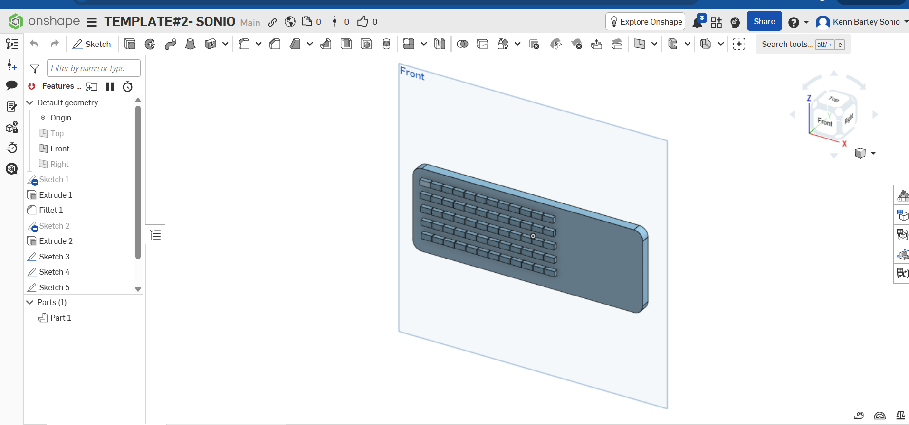
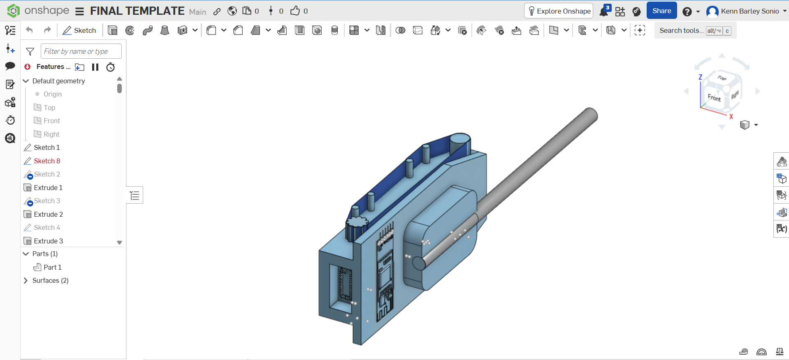
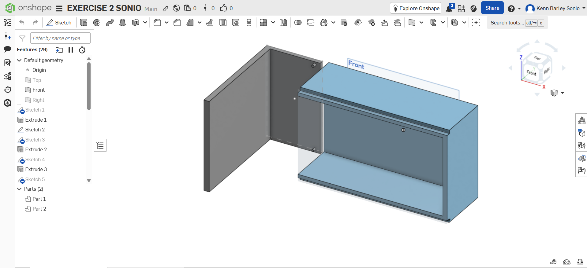
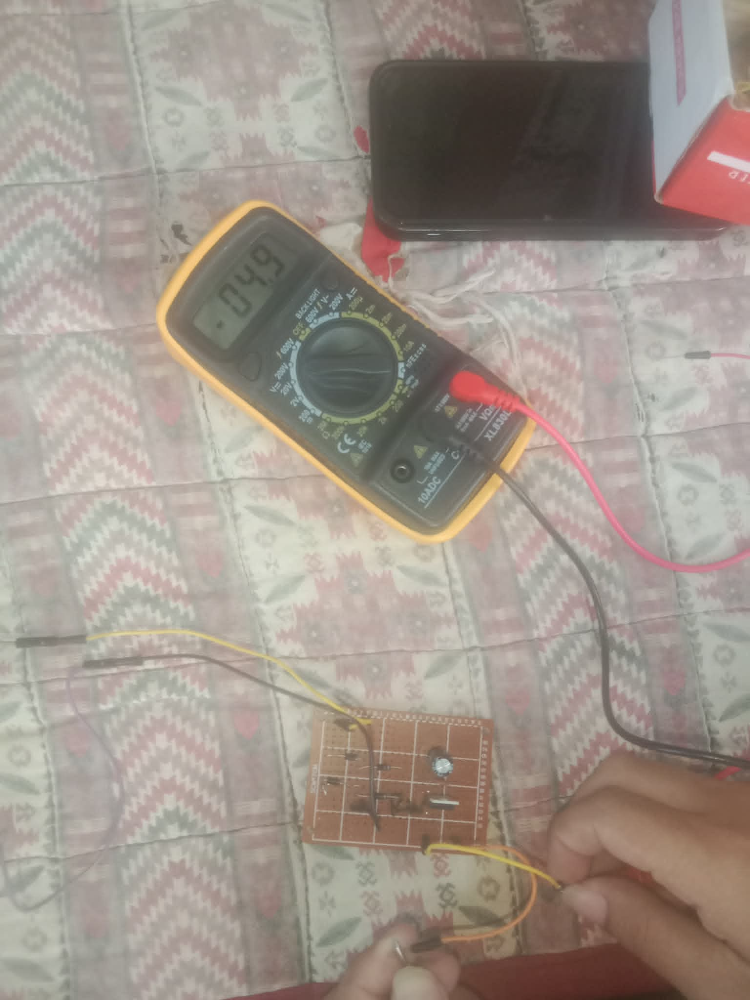
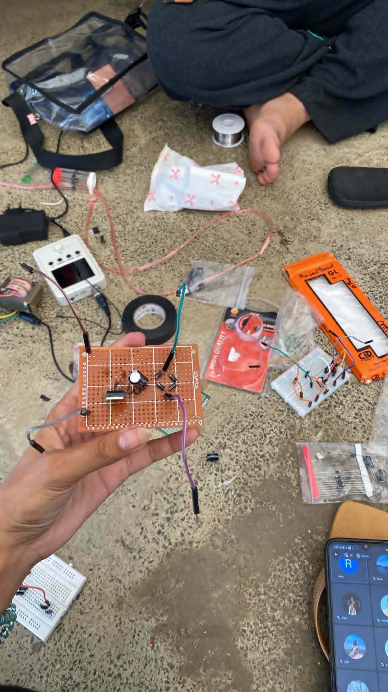

# Kenn Sonio Portfolio

Welcome to my Computer Engineering portfolio repository.

I am a BS Computer Engineering student from CE3A. This portfolio contains academic projects, activities, and technical outputs that demonstrate my learning and experience in software and hardware development.

---

#  Personal Information

- Course: Bachelor of Science in Computer Engineering
- Section: CE3A

I am passionate about programming, software development, and modern technology. I enjoy learning new skills and creating innovative projects.

---

# Technical Skills

- Python Programming
- GitHub
- Canva
- Firebase
- React Native
- Microsoft Office

---

# Projects

---

##  Electronic Circuit Project

Description:

A hands-on electronics project involving circuit assembly, soldering, and voltage testing using electronic components and a digital multimeter.

Tools & Components Used:
- Multimeter
- Breadboard
- Electronic Components
- Soldering Materials

---

## 3D CAD Modeling Projects

Description:

A collection of 3D modeling and engineering design activities created using Onshape. These projects demonstrate my skills in CAD modeling, technical design, and product visualization.

Tools Used:
- Onshape
- CAD Modeling

### Project Screenshots

## Fitness Tracking and Meal Planning Mobile Application

Description:

A mobile application project focused on fitness activity tracking, meal planning, and progress monitoring using Firebase backend services and React Native development.

Technologies Used:
- React Native
- Firebase
- Cloud Firestore

.png)

---

## Waterfall Model Presentation

Description:

A presentation discussing the Waterfall Software Development Model.

---

## Simple Python Calculator

Description:

A calculator program developed in Python that performs basic mathematical operations.

Technologies Used:
- Python
- VS Code

---

## Behavior-Based Safety Presentation

Description:

A presentation about workplace safety practices and Behavior-Based Safety concepts.

Tools Used:
- Canva

---

# 📞 Contact Information

Email: soniokenn04@email.com